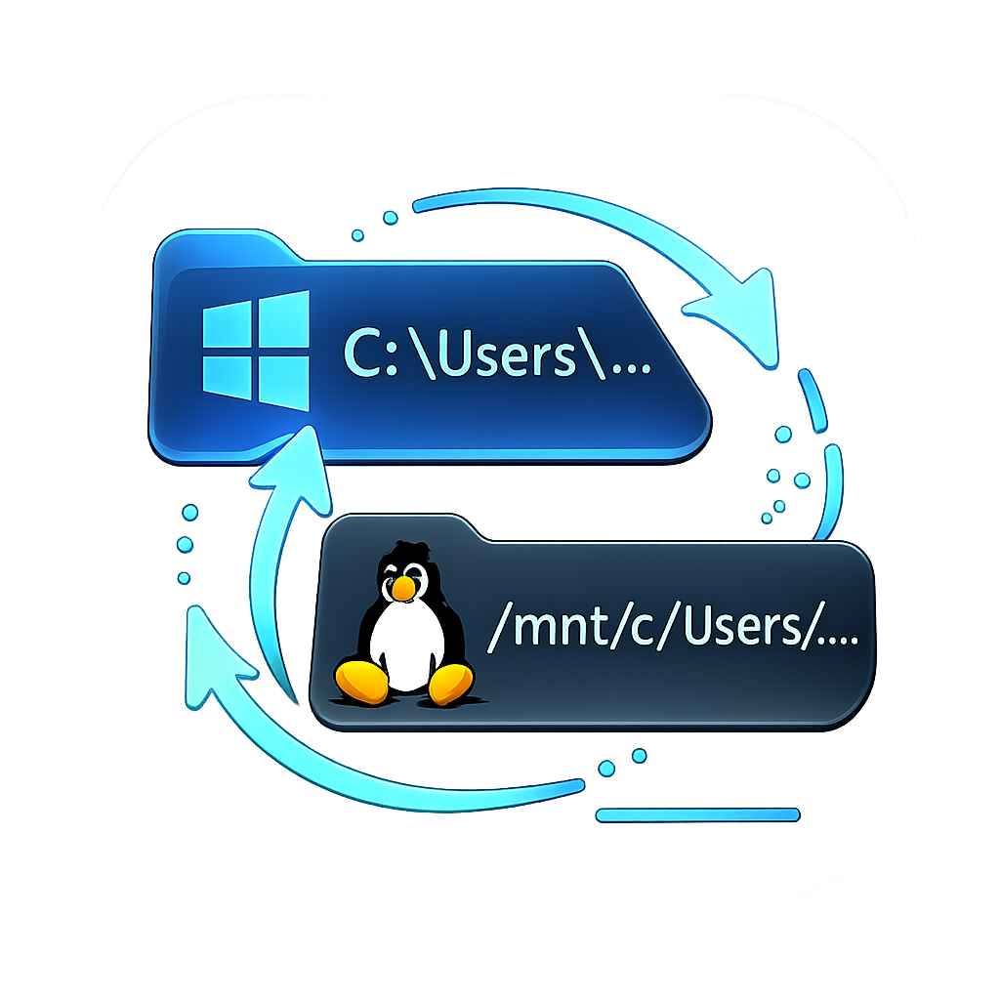

# wsl-path-converter

`C:\Users\me\project` -> `/mnt/c/Users/me/project`

Copy and convert with `Ctrl+Shift+C`, or convert on paste with `Ctrl+Shift+V`.

## Install

[Download](https://github.com/developer0hye/wsl-path-converter/releases/latest/download/wsl-path-converter.exe) -> Run -> Done.

## Conversions

| You copy | You get |
|---|---|
| `C:\Users\me\project` | `/mnt/c/Users/me/project` |
| `/mnt/c/Users/me/project` | `C:\Users\me\project` |
| `/home/me/.config` | `\\wsl.localhost\Ubuntu\home\me\.config` |
| `\\wsl$\Ubuntu\home\me` | `/home/me` |

## How it works

1. Copy any path text (for example, Explorer `Ctrl+Shift+C` / Copy as path).
2. Press `Ctrl+Shift+C` to keep the normal copy action and convert the clipboard path.
3. Or press `Ctrl+Shift+V` to paste a converted path from clipboard.

If the clipboard text is not a supported path, normal `Ctrl+Shift+C` / `Ctrl+Shift+V` behavior is preserved.

The app runs in the system tray and auto-detects your WSL distro.

It starts with Windows automatically. To disable, right-click the tray icon and uncheck **Start with Windows**.
